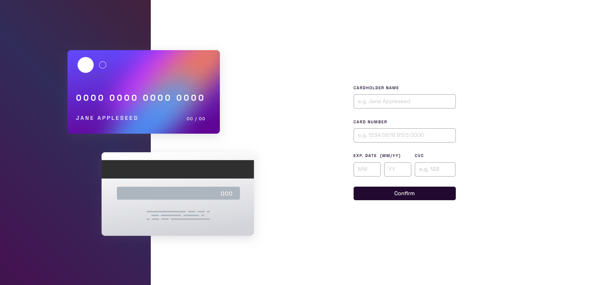
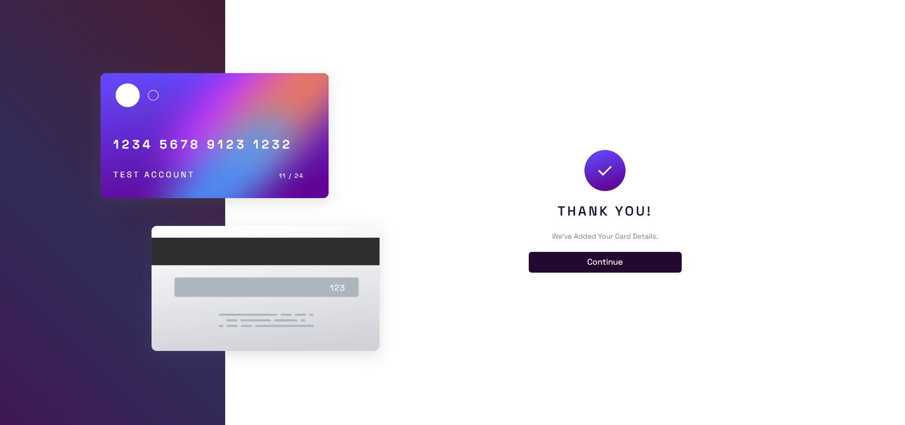

# Frontend Mentor - Interactive card details form solution

This is a solution to the [Interactive card details form challenge on Frontend Mentor](https://www.frontendmentor.io/challenges/interactive-card-details-form-XpS8cKZDWw). Frontend Mentor challenges help you improve your coding skills by building realistic projects. 

## Table of contents

- [Overview](#overview)
  - [The challenge](#the-challenge)
  - [Screenshot](#screenshot)
  - [Links](#links)
  - [Built with](#built-with)
  - [What I learned](#what-i-learned)
  - [Continued development](#continued-development)
  - [Useful resources](#useful-resources)
  - [Author](#author)

## Overview

My Solution to the interactive card details form challenge, using React JS as my primary tool, alongside several libraries to test and polish my skills (React-hook-form, React-Router, Framer-motion etc.). 

### The challenge

Users should be able to:

- Fill in the form and see the card details update in real-time
- Receive error messages when the form is submitted if:
  - Any input field is empty
  - The card number, expiry date, or CVC fields are in the wrong format
- View the optimal layout depending on their device's screen size
- See hover, active, and focus states for interactive elements on the page

### Screenshot

### Links

- Solution URL: [Add solution URL here](https://your-solution-url.com)
- Live Site URL: [Add live site URL here](https://your-live-site-url.com)

### Built with

- CSS custom properties
- Flexbox
- CSS Grid
- Mobile-first workflow
- [React](https://reactjs.org/) - JS library
- [Next.js](https://nextjs.org/) - React framework
- [Styled Components](https://styled-components.com/) - For styles
- [Framer Motion](https://www.framer.com/motion/) - Simple Animation
- [React Hook Form](https://www.react-hook-form.com/) - Form Handling
- [React Router](https://reactrouter.com/en/main) - React Router

### What I learned

I learned about some complex form validation, particuarly intergrating react-hook-form with styled components and traditional javascript to accept specific patterns from the user. I also polished my React Router Skills for some simple navigation upon successful form submission. 

### Continued development

I would like to continue the project, focusing on a more fleshed-out responsive design for mobile and various other screen sizes. I struggled with the desktop-first workflow and hope to work with a more comprehensive layout i can follow, so that the implementation of responsive design can be easier.

### Useful resources

- [React Hook Form Docs](https://www.react-hook-form.com/) - This helped me for understanding the React Form props and validation techniques. 
- [ChatGPT](https://chat.openai.com/) - This helped me to proof-read and analyse my code for any inconsistencies or help me out with minor issues i couldn't see in the moment.

## Author

- Website - [My Links!](https://linktr.ee/OllieJ23)
- Frontend Mentor - [@OllieJ23](https://www.frontendmentor.io/profile/OllieJ23)
